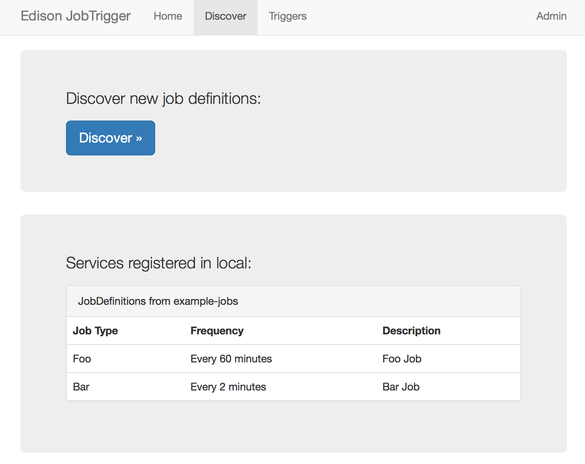
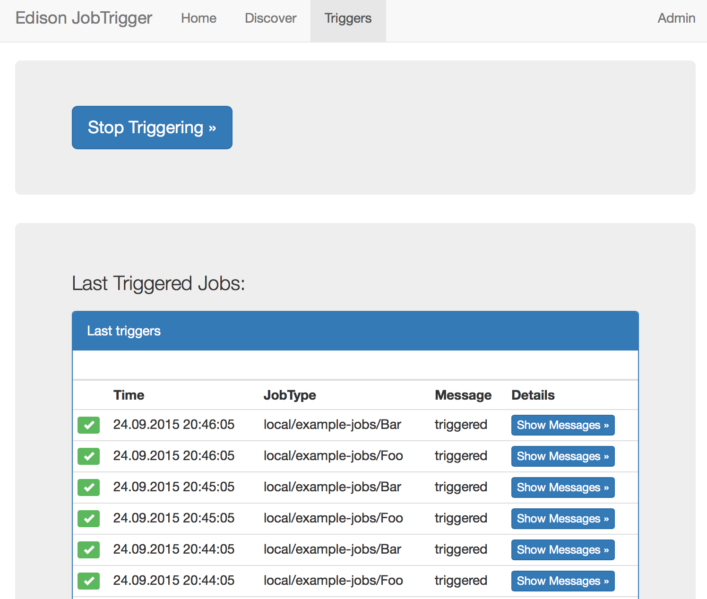
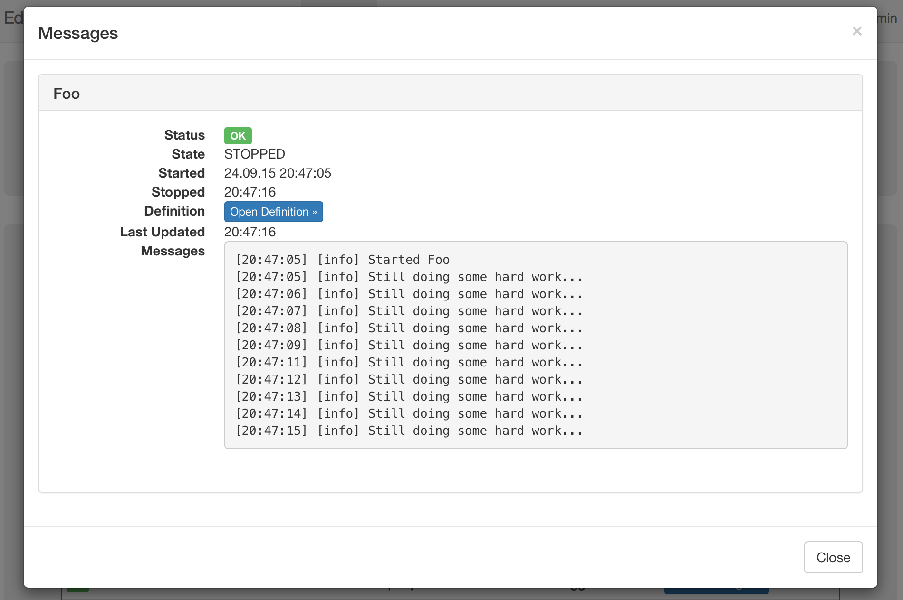

[Edison Microservice](https://github.com/otto-de/edison-microservice) is a library to write 
production-ready Microservices on top of Spring Boot. It is actively used at [otto.de](https://www.otto.de).

Because Microservices should be loosly coupled, they often need to import data from other systems - at least 
in our architecture. To make such kind of background jobs as easy to implement as possible, and to run them 
on a regular base in clustered environments, we need a component that is triggering these jobs as needed:
that's the purpose of 

# Edison JobTrigger

All Edison Microservices may announce JobDefinitions: specifications about jobs telling a JobTrigger (or other tools)
how a Job is triggered, in what frequency this should happen, and so on.

If a JobTrigger server is configured, the Microservice will register itself at startup and, in the following, 
update this registration every few minutes. The JobTrigger is querying all supported JobDefinitions and will 
trigger the jobs of all registered Microservices according to their definition.

Edison JobTrigger supports multiple services from different groups (or Teams) in multiple environments
(test, prelive, live...).

That's it.

# Usage

```
gradlew build
java -jar build/libs/edison-jobtrigger-1.0.0.jar
```

Write an Edison Microservice (or simply use [Example-Jobs](https://github.com/otto-de/edison-microservice/example-jobs) 
as an example) including some jobs and job definitions. 

Configure some additional properties in your service:
```properties
edison.servicediscovery.servers=http://localhost:8080/jobtrigger # where to find the JobTrigger
edison.servicediscovery.service=http://localhost:${server.port}/${server.context-path} # where to find the service
# Optionally override defaults:
# edison.servicediscovery.expire-after=15 # expire the registration of the service after N minutes.
# edison.servicediscovery.refresh-after=5 # reload JobDefinitions after N minutes
# edison.servicediscovery.environment=unknown # the environment of the service (live, develop, ...)
# edison.servicediscovery.group=default # the group of the services. In our case it's the name of a team
```

Run JobTrigger + your service(s). After some time (one minute), JobTrigger will find the JobDefinitions 
of your services and start the triggers accordingly.

# Discovery

Because JobTrigger has no persistency, Services have to re-register every few minutes: this is the purpose
of property edison.servicediscovery.expire-after.

The known services and their JobDefinitions can be seen on the Discovery page:


# Triggers

Because services can be deployed at any time, the JobTrigger will load current JobDefinitions every few minutes.
The interval is configured using edison.servicediscovery.refresh-after.

After a while, you can see the triggered jobs on the Trigger page:


# Job Information

You can access the asynchronously running job by opening the messages: 



Have fun!
